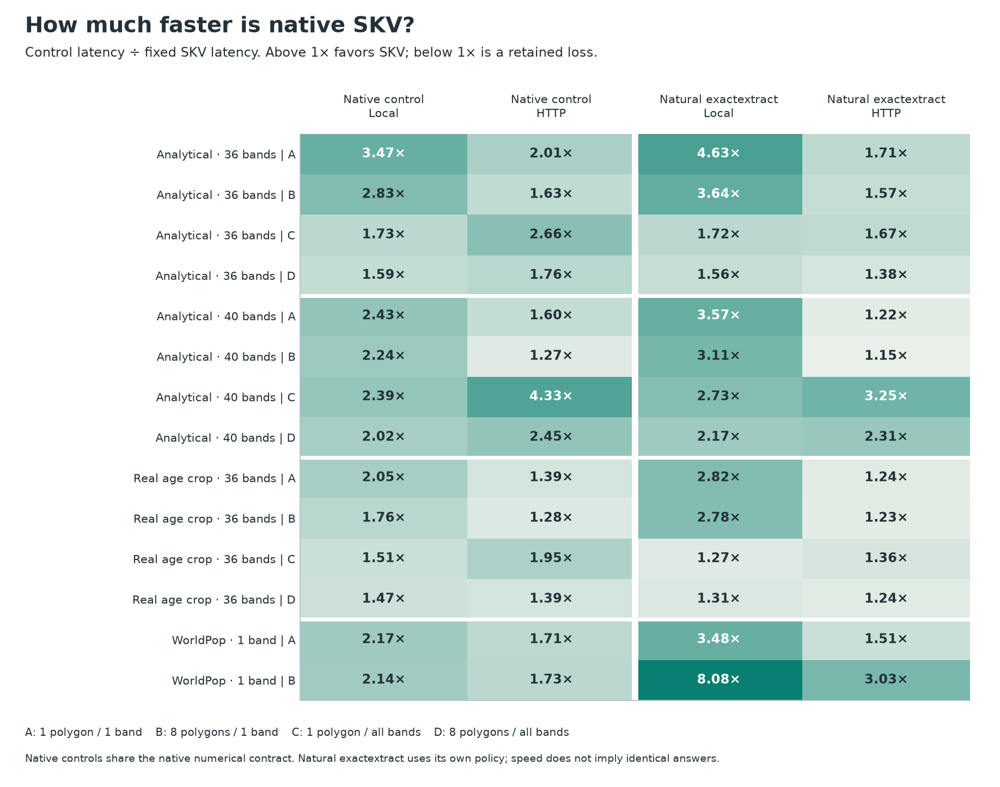

<p align="left"></p>

**Raster + polygon → statistics, with explicit numerical policies and bounded source access.**

Skarve owns source opening, decoding, caching, geometry and aggregation. Use a supported TIFF/COG directly, or compile a lossless, self-contained **SKV** snapshot for repeated queries. Serving SKV does not require the original raster. Keep a source open for repeated selections; use `cleave` for shared batch execution across polygons and raster slices.

**Rust · Python · Node.js/TypeScript · CLI**. Launch candidate **0.1.1-alpha.2**; SKV v0 is experimental. The qualified native target is **Ubuntu 24.04, Linux x86-64, GDAL 3.8.4 and libdeflate 1.19**. Windows/macOS, arbitrary grids and global HM deployment are not claimed. Polygons must already use the source CRS; supported grids are north-up and axis-aligned. [Supported contracts](docs/limitations.md).

This is the public **source-only alpha release**. Build from source using the instructions below. Registry packages and prebuilt binary downloads are not yet available. [Build/install from source](docs/INSTALL.md); [source and binary distribution gates](release/DISTRIBUTION.md).

## Try it with generated data

After following the installation guide, generate a small mathematical fixture. These commands need no HM code, credentials or external raster downloads:

```sh
python examples/generate_fixtures.py example-data
skarve compile example-data/original.tif --output example-data/snapshot.skv \
  --chunk-edge 128 --band-group 4 --predictor byte_delta_v1
skarve carve example-data/snapshot.skv example-data/polygon.json \
  --crs EPSG:3857 --bands 0 --metrics sum,support,mean,min,max
```

The snapshot path must be new. Preparation is optional; pass the TIFF to `carve` for the direct path. Rebuild an immutable snapshot when its source changes. [SKV workflow and format](docs/skv.md).

```python
from skarve import Skarve

zone = {"type": "Polygon", "coordinates": [[[0, 0], [2, 0], [2, 2], [0, 2], [0, 0]]]}
with Skarve() as engine:
    with engine.infuse("example-data/snapshot.skv") as source:
        result = source.carve(zone=zone, crs="EPSG:3857", bands=[0],
                              metrics=["sum", "mean"], backend="native")
        print(result["bands"][0]["fractional_sum"])
```

```js
import Skarve from '@skarve/engine';
const engine = new Skarve();
try {
  const source = await engine.infuse('example-data/snapshot.skv');
  const zone = {type: 'Polygon', coordinates: [[[0,0],[2,0],[2,2],[0,2],[0,0]]]};
  try {
    const result = await source.carve({zone, crs: 'EPSG:3857', bands: [0],
      metrics: ['sum', 'mean'], backend: 'native'});
    console.log(result.bands[0].fractional_sum);
  } finally { await source.close(); }
} finally { await engine.close(); }
```

The [Rust guide](docs/rust.md) provides a safe RAII consumer and an external Cargo example, including conversion, single queries and streamed native batch pages. The C ABI library name remains compatible. Full installed [Python](examples/python_skv.py) and [Node](examples/node_skv.mjs) examples also consume complete `cleave` results.

| Interface | Start here | Full workflow |
|---|---|---|
| Rust | [Rust consumer guide](docs/rust.md) | [External crate example](examples/rust-consumer) |
| Python | [Python API](docs/python.md) | `python examples/python_skv.py --fixture example-data/fixture.json --output example-data/python.skv` |
| Node.js / TypeScript | [Node API and types](docs/node.md) | `node examples/node_skv.mjs example-data/fixture.json example-data/node.skv` |
| CLI | [Commands](docs/cli.md) | `infuse`, `compile`, `carve`, `cleave`, `verify-skv` |

Read original scalar windows and independent masks through the bounded Rust, Python, Node and C interfaces. [Source-window values, ownership, query lifecycle and HTTP limits](docs/source-windows.md).

## Measured performance, with the scope attached

The final **native Skarve + SKV** benchmark completed 588 operations. Summary-enabled SKV had lower median complete-query latency in all 28 tested workload/transport scenarios: **1.15–8.08× versus natural upstream exactextract**, and **1.27–4.33× versus the best of four predeclared native TIFF/COG/indexed-COG controls**. Preparation is excluded and reported separately. This measures frozen runtime **d15b0bc**, not the rebuilt launch wrapper.



One host, three observations per scenario; one/eight polygons; one/36/40 bands; five statistics; generated36/40, a real36 crop and a WorldPop query window. Local and unthrottled loopback HTTP use fresh readers/processes, with **uncontrolled OS cache**. Natural exactextract uses a different numerical policy. One individual SKV-versus-exactextract observation was slower; summary ablations and earlier-build batch regressions are retained. Conversion took about 1–44 seconds for those unchanged objects and SKV was not always smaller. These results establish neither universal superiority nor R2/production performance.

[Full report, absolute times, CPU, memory, traffic and losses](benchmarks/native-skv/REPORT.md) · [Public data and reproduction](benchmarks/native-skv/REPRODUCE.md).

## Numerical and operational contract

Native strict fractional coverage remains the default. Masks, NoData, scale/offset, band order and reducer policy are explicit. Optional pinned exactextract execution is selected only under its eligible policy; it never silently relaxes a strict native request. HM-compatible ordered selections are a separate opt-in API, not fractional summaries. [Numerics](docs/NUMERICS.md) · [Backends](docs/backends.md) · [Ordered source selections](docs/ordered-source.md).

Source generations, checksums, conditional HTTP ranges, cancellation and resource admission are part of the supported contract. Application deployments still control allowed URLs, credentials and process limits. The direct source abstraction remains valid; SKV conversion is never a universal requirement.

## Authorship and contribution

Created by **Florent Chif**, from the raster-analysis needs behind Horizon Mapper. Integration into HM is being tested; this project does not claim production adoption. Skarve combines independently authored systems engineering with attributed upstream libraries and established techniques. It makes no claim to have invented zonal statistics, scanlines or aggregate hierarchies.

[Contributing](CONTRIBUTING.md) · [Security](SECURITY.md) · [Citation](CITATION.cff) · [Apache-2.0 license](LICENSE) · [Third-party notices](THIRD_PARTY.md). The engine is released under Apache-2.0; binary distribution has a separate gate. Branding rights are separate.
