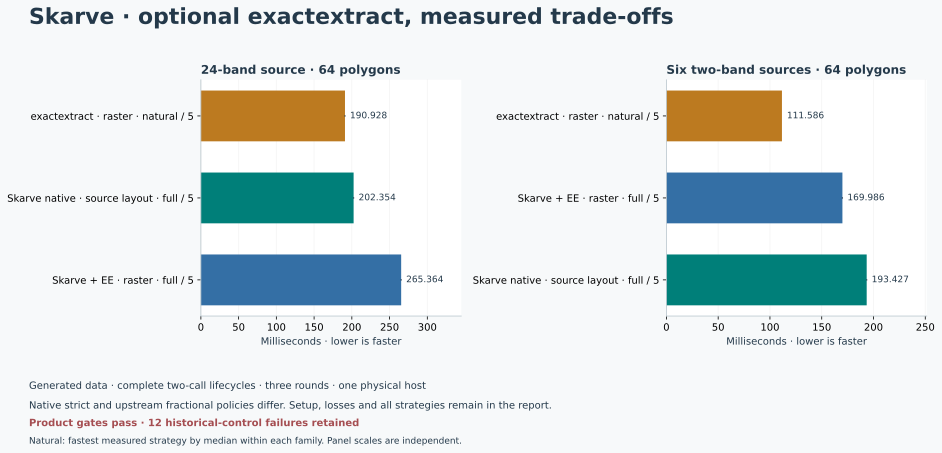
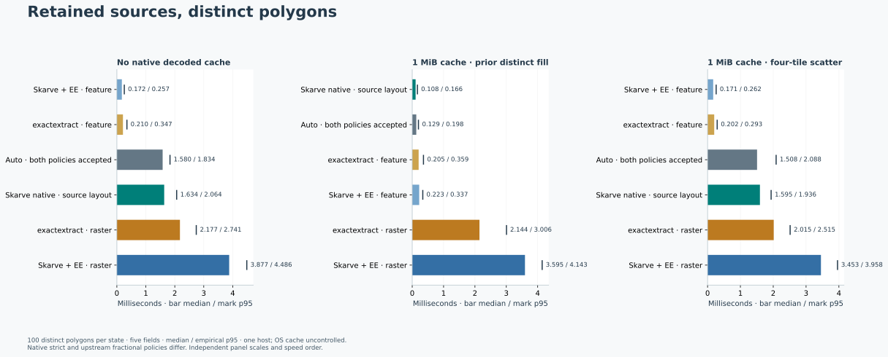
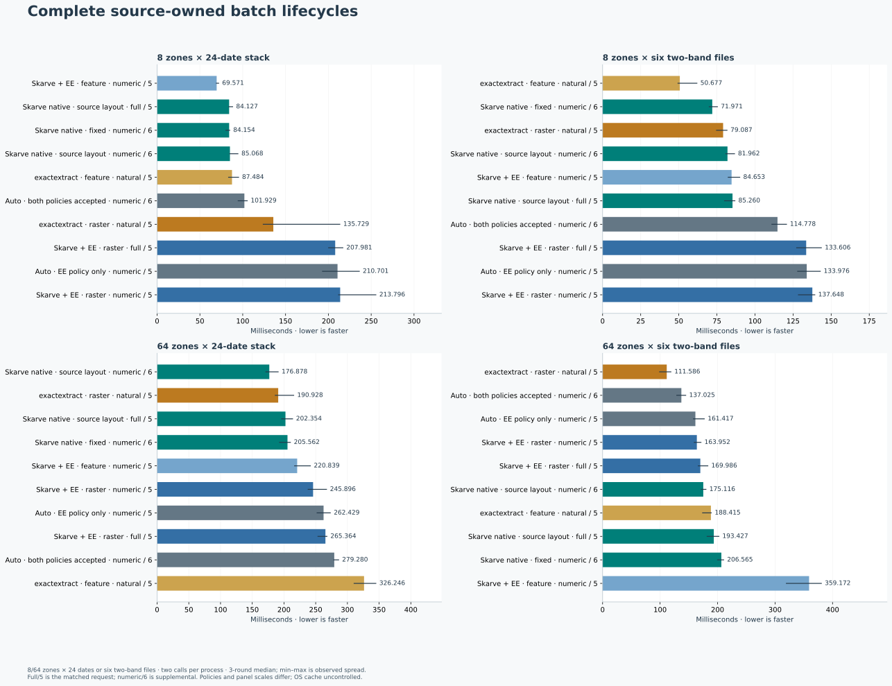
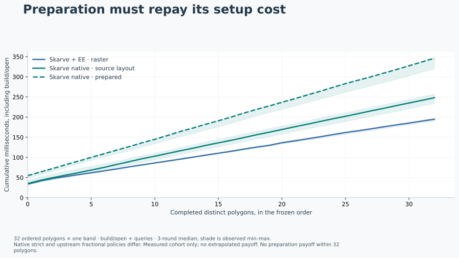
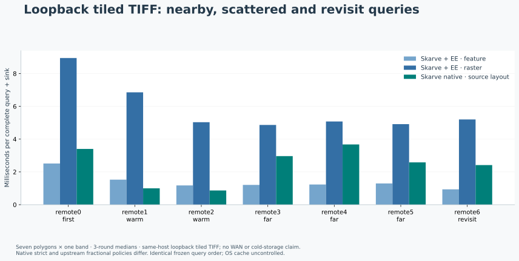
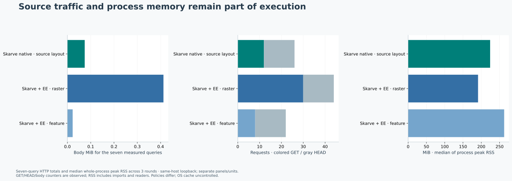
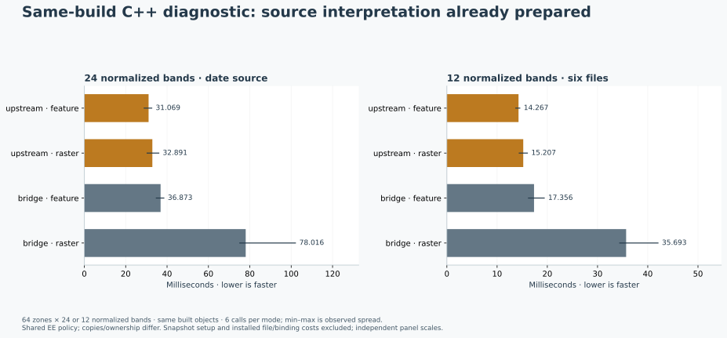
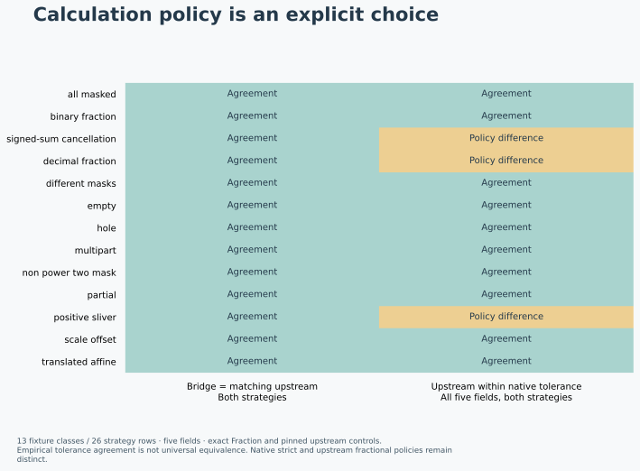

# Skarve Benchmark Report

Optional exactextract · beta.2

Product gates pass · 12 historical-control failures retained. 168/168 task receipts have complete executed outputs; 156 passed their applicable numerical gates. The aggregate programme remains passed=False. Installed package source `131508f4b4a441c5247742c196cf9060b6ea5e81`; benchmark harness source `961af37b3f618c4d9ea84e2166b7958a5079449b`; native SHA `4c20fbc0e5486c0f4d3a0a457664211074ff4c65c21fb412fa268943e7a57818`; generated seed `164907040060856`.



Paired native/full and delegated raster/full request the same five statistics for the larger generated batch. The natural control is the fastest measured natural strategy by median lifecycle, selected after measurement within each family. Native compact six-field controls and other losses remain visible in the full report. Medians shown; panel scales are independent and batch figures retain spread. Numerical policies and output metadata shapes differ; full receipt, projection and sink costs are charged.

Disposition: the optional embedded backend is supported only for its explicit upstream fractional policy and documented eligible requests. Its benefit depends on workload and strategy; the report retains both wins and losses against native and natural upstream controls. Native strict remains the default. Accepting the native policy keeps auto on native; EE-only acceptance can select EE. These results do not enable performance-driven cross-policy promotion.

## Scope and interpretation

This is a finite generated-data evaluation of an optional backend in the ordinary installed source/query interface. It is not a new zonal-statistics algorithm, an application adoption study, or evidence that one backend is universally faster.

Native strict and exactextract fractional calculation use different finite-precision contracts. Five shared fields are compared: sum, valid fractional support, mean, minimum and maximum. Support is not an integer count. Forced delegation, strict conflicts and unsupported hard-isolation requests are tested separately.

Each timed worker is a fresh process, with retained work inside it. Interpreter/import process wall, source setup, first/repeated calls, canonical result consumption, cleanup, cache counters and peak RSS are retained. Nested processor/bridge/callback clocks must not be added. Fixture generation and independent oracles are outside timed operations.

No claim of cold disk, WAN/cloud latency, another physical host, or inferred process-isolation protection is made. HTTP figures use bounded conditional loopback requests. No private application comparison is included.

An empty Skarve decoded cache is not cold operating-system or storage state: the kernel page cache was not flushed. Auto with only the EE policy accepted can select EE; accepting the native policy continues to select native. These measurements do not promote cross-policy performance routing.

The old isolated adapter, when supplied as a private development control, remains separately labelled and is not exported as a release dependency. It has a 1 GiB worker and 16 MiB worker GDAL cache; it is not silently treated as an equal-budget embedded route.

The timing harness was frozen before measurement and its source checks passed at completion. Later report-only changes classify the historical failures, compact retained JSON and add readable figure labels; the final report generator hash is recorded separately. Core, bindings, timed worker and programme code remain unchanged. Exact timing-harness revision is recoverable from Git history; replay from final source uses the same timing logic and seed in a fresh directory.

[Retained beta1 historical benchmark report](../../report/index.html). Its inputs, runtime and lifecycle definitions remain separate; beta2 does not replace its losses.

## Failures remain part of the result

| Failed control / method | Tasks | Field mismatches |
|---|---:|---:|
| Isolated adapter · feature | 6 | 36,000 |
| Isolated adapter · raster | 6 | 36,000 |

[Exact task IDs, differences and retained observations](data/programme.json.gz).

The historical isolated adapter failed 12 final controls (72,000 mismatching field comparisons). A two-band untimed reproduction isolates unnamed RasterSource wrappers: unique names restore the expected distinct answers in both strategies. The historical adapter is unchanged, its timings are invalid controls with no ratios, and the aggregate failure is preserved. See [bounded diagnosis](ISOLATED_CONTROL_FINDING.md) and [reproduction receipt](data/reference-names.json).

Earlier failures remain separate from the final gate: [40-task prior receipt](data/history-01.json.gz) (11 failed gates); [8-task prior receipt](data/history-02.json.gz) (4 failed gates). [Cropped NumPy reference diagnosis and correction](REFERENCE_VALIDITY.md); [small pinned reproduction output](data/reference-validity.json).

## Measured families

### Retained sources, distinct polygons



Complete query plus canonical five-field sink. One process per method/state; p95 is over distinct geometry IDs. Panels use independent scales and speed order; cross-panel bar lengths are not comparable. Source registration and a separate distinct cache-fill query are charged in raw lifecycle data. OS cache is uncontrolled; reference GDAL cache remains enabled.

### Complete source-owned batch lifecycles



Open/register, first all-zone call, one repeated aligned call, output normalization/sink, close. Full / 5 lanes request the same five statistics; rich metadata differs and is charged. Native numeric / 6 and native-selected auto also compute/return integer count as supplemental competent controls; projection follows the complete response. Natural and delegated numeric lanes request five. Bars are three-round medians with observed min–max marks (smoke has one), not confidence intervals. Panels use independent scales and speed order. Historical isolation has its own lifecycle table.

### Preparation must repay its setup cost



Observed cumulative costs for the same large-interior polygon cohort. Native preparation retains original boundary values; index bytes and build/open costs are recorded. The shaded range is the observed three-round spread. A crossing is measured only within this cohort; no 1,000-query extrapolation is presented as a result.

### Loopback tiled TIFF: nearby, scattered and revisit queries



Fresh source session per round, stable conditional validators and 1 MiB native decoded cache. The coordinate sequence is labelled in advance; raw cache counters establish actual hits and evictions. Original encoded bytes travel through the same bounded source interface. The server runs on the same host with no injected network delay; these are not WAN/cloud benchmarks. Mutation rejection is retained.

### Source traffic and process memory remain part of execution



Server-observed body bytes and HTTP method counts for measured queries. Source registration, guard-failure probes and server setup are separate raw records; no HEAD/body double counting. Peak RSS covers each complete worker, including interpreter, imports and loopback server; bars show the median of three independent process peaks, not synchronized memory or a hard embedded limit. A cache can eliminate body transfers while identity requests remain.

### Same-build C++ diagnostic



Independent upstream ArraySource/MapWriter versus leased-window bridge. Both receive identical pre-normalized arrays/WKB. Bars pool first and repeated calls (two per process); marks are observed min/max across those calls, not independent-trial confidence intervals. Bridge callbacks copy windows; natural control views them. Complete C++ timers exclude binary snapshot load/JSON stdout, which remain separately charged. Do not divide these array timers into installed original-file calls and call the result pure bridge overhead.

### Calculation policy is an explicit choice



Finite exact-Fraction calibration, including raw masks, scale/offset, empty support, signed cancellation and tiny positive cells. Upstream differences are not labelled an approximate center rule or a bridge bug. Strict-native default routing remains separate. The calibration does not establish universal equivalence or an upstream error bound.

## Rejection and cancellation costs

A separate installed functional-cost probe records rejection, active cancellation and drain. Its deliberately held remote callback contributes 25 ms; cancel-to-drain is not CPU-only interrupt latency. The interrupted reader must be closed/reinfused; the session can then be reused. [Scope, measured table and commands](FAILURE_CANCELLATION.md), [raw receipt](data/failure-cancellation.json).

## Lifecycle and output appendix

Median costs in milliseconds for the larger batch, including all rich and historical isolated lanes. First and retained columns include result projection and canonical sink. Setup, calls and cleanup are inside lifecycle; worker process wall additionally includes Python startup/imports, bookkeeping and receipt transfer. Sink and isolated worker startup are nested diagnostics, not costs to add again. Native full output computes/serializes its richer result before the common five-field projection. An isolated control uses its separately recorded worker/resource envelope. The last column is the ratio of medians: faster natural upstream strategy / named method; above 1 means the named method takes less time. The natural strategy is selected after measurement within the same family/size. Native numeric is a supplemental six-field control; full native/EE lanes request the same five fields, with different charged metadata shapes. INVALID rows retain measured costs only: their answers failed the control and no speed ratio is computed.

| Family / output | Method | Setup | First | Retained | Two-call lifecycle | Process wall | Natural / method |
|---|---|---:|---:|---:|---:|---:|---:|
| dates / numeric | Auto · both policies accepted · numeric / 6 | 32.477 | 120.961 | 125.622 | 279.280 | 413.430 | 0.684× |
| dates / numeric | Auto · EE policy only · numeric / 5 | 34.273 | 129.227 | 101.991 | 262.429 | 397.940 | 0.728× |
| dates / numeric | Skarve + EE · feature · numeric / 5 | 32.418 | 94.072 | 94.058 | 220.839 | 352.709 | 0.865× |
| dates / full | Skarve + EE · raster · full / 5 | 32.731 | 117.089 | 111.914 | 265.364 | 399.055 | 0.719× |
| dates / numeric | Skarve + EE · raster · numeric / 5 | 33.197 | 108.192 | 105.691 | 245.896 | 377.831 | 0.776× |
| dates / five-field canonical | INVALID · Isolated adapter · feature | 148.261 | 73.556 | 33.080 | 262.862 | 373.939 | not comparable |
| dates / five-field canonical | INVALID · Isolated adapter · raster | 154.638 | 65.925 | 26.902 | 252.380 | 361.263 | not comparable |
| dates / numeric | Skarve native · fixed · numeric / 6 | 35.657 | 86.408 | 81.959 | 205.562 | 344.973 | 0.929× |
| dates / full | Skarve native · source layout · full / 5 | 34.759 | 82.190 | 85.086 | 202.354 | 338.883 | 0.944× |
| dates / numeric | Skarve native · source layout · numeric / 6 | 31.842 | 72.591 | 72.849 | 176.878 | 314.429 | 1.079× |
| dates / numeric | exactextract · feature · natural / 5 | 14.751 | 166.455 | 143.674 | 326.246 | 545.639 | 0.585× |
| dates / numeric | exactextract · raster · natural / 5 | 17.692 | 124.902 | 54.453 | 190.928 | 428.424 | 1.000× |
| files / numeric | Auto · both policies accepted · numeric / 6 | 39.033 | 55.775 | 41.837 | 137.025 | 252.672 | 0.814× |
| files / numeric | Auto · EE policy only · numeric / 5 | 37.421 | 67.000 | 56.709 | 161.417 | 263.019 | 0.691× |
| files / numeric | Skarve + EE · feature · numeric / 5 | 36.094 | 162.835 | 161.304 | 359.172 | 460.428 | 0.311× |
| files / full | Skarve + EE · raster · full / 5 | 36.242 | 74.661 | 61.782 | 169.986 | 269.207 | 0.656× |
| files / numeric | Skarve + EE · raster · numeric / 5 | 37.041 | 65.246 | 61.411 | 163.952 | 264.622 | 0.681× |
| files / five-field canonical | INVALID · Isolated adapter · feature | 167.479 | 70.525 | 25.762 | 275.190 | 356.303 | not comparable |
| files / five-field canonical | INVALID · Isolated adapter · raster | 165.657 | 64.817 | 19.300 | 259.445 | 339.730 | not comparable |
| files / numeric | Skarve native · fixed · numeric / 6 | 35.171 | 85.848 | 84.430 | 206.565 | 310.634 | 0.540× |
| files / full | Skarve native · source layout · full / 5 | 39.669 | 79.196 | 69.703 | 193.427 | 301.950 | 0.577× |
| files / numeric | Skarve native · source layout · numeric / 6 | 35.864 | 72.223 | 66.802 | 175.116 | 274.838 | 0.637× |
| files / numeric | exactextract · feature · natural / 5 | 21.001 | 95.824 | 65.931 | 188.415 | 379.222 | 0.592× |
| files / numeric | exactextract · raster · natural / 5 | 16.659 | 64.487 | 28.066 | 111.586 | 298.724 | 1.000× |

[All lifecycle, startup, sink and memory observations](lifecycle_data.csv).

## Reproduce

Install the approved optional-feature artifact and benchmark dependencies. Run the finite commands below in a fresh output directory and a serial timing lane. The old private adapter is optional and is omitted from this portable command. No network dataset is fetched.

```sh
python benchmarks/beta2/programme.py freeze --output scratch/beta2 --artifacts dist/beta2 --seed 164907040060856
python benchmarks/beta2/programme.py run --output scratch/beta2
python tests/exactextract_contracts.py --enabled yes --scratch scratch/calibration --output scratch/calibration.json
python benchmarks/beta2/cpp_control.py --folder scratch/beta2 --control target/exactextract-control/skarve-ee-control --output scratch/cpp --zones 64 --rounds 3 --native-build-receipt "$NATIVE_BUILD_RECEIPT"
python benchmarks/beta2/report.py --input scratch/beta2/programme.json --calibration scratch/calibration.json --cpp-control scratch/cpp/results.json --output scratch/report
```

The C++ control executable is a separately built diagnostic; its build command is in the optional-backend native build instructions. Set NATIVE_BUILD_RECEIPT to the receipt emitted by the optional build that produced the measured library; the control verifies exact upstream archive, bridge object and GEOS hashes. Source builds and ordinary installed execution remain separate provenance modes.

[Complete retained data](data/programme.json.gz), [chart CSV](chart_data.csv), [summary and hashes](summary.json).

Archive replay: the timing harness enumerates tracked source files. If starting from a source tarball without Git history, first run `git init`, `git add -A`, and a local snapshot commit using your own configured author. This creates replay provenance; it does not reproduce the original commit ID. The archive SOURCE_MANIFEST and unchanged native hash retain the distributed-source identity. A normal clone already has the required Git metadata.

Environment: `{"cpu_model": "AMD Ryzen 7 8745HS w/ Radeon 780M Graphics", "kernel": "6.6.87.2-microsoft-standard-WSL2", "logical_cpus": 12, "machine": "x86_64", "system": "Linux"}`. Versions: `{"exactextract": "0.3.0", "numpy": "2.5.3", "python": "3.12.3", "rasterio": "1.5.1", "shapely": "2.1.2"}`.

## Statistical definitions

Three independent worker lifecycles per method/shape. Each lifecycle contains first and repeated aligned call. Medians and min/max are observed spread, not confidence intervals. Full native/EE lanes request the identical five fields. Native numeric and native-selected auto require integer count as a sixth field; these are supplemental competent controls, projected to five after the complete response is charged.

100 distinct geometries per retained-source state/method in one process; linear-interpolated empirical p95 within that sequence. Source registration and distinct warmup separately charged.

Ratio of the named methods median costs, never an unlabeled median of per-query ratios.

Measured cumulative costs across the identical ordered cohort, including build/register. No linear extrapolation labelled as observed break-even.
