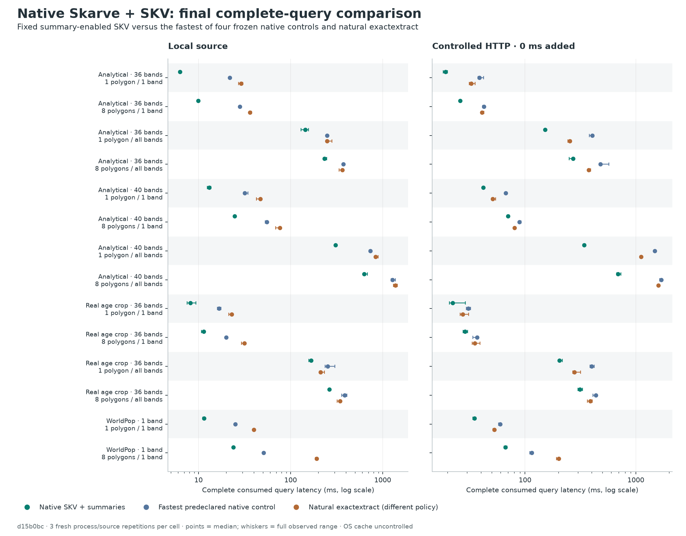
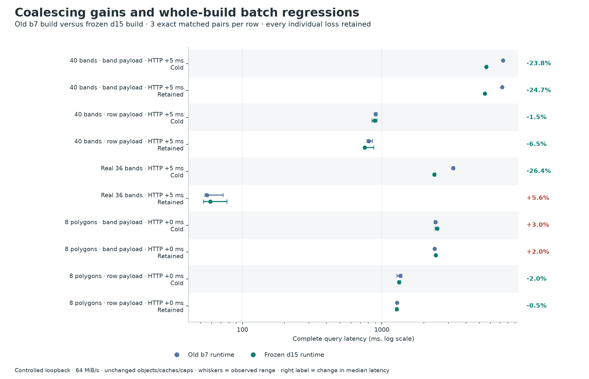

# Skarve Benchmark Report: native Skarve + SKV

These are the final saved measurements of runtime **d15b0bc**, qualified on 15 September 2026. The launch candidate adds a Rust consumer API and release documentation; it has not been substituted into these historical timings. The benchmark uses the native engine, not the optional exactextract backend.

**Recommendation: freeze d15b0bc for review and close this optimization campaign.** No correctness or integration defect required an engine patch. The accepted native-window fusion, boundary coalescing, shared masks and narrow median reuse remain intact. CLI, Python and Node packages are qualified, byte-pinned and available privately.

In this new frozen comparison, **native SKV with summaries wins all28 workload/transport medians**: **1.27–4.33×** faster than the fastest of the four predeclared native TIFF/COG/indexed-COG controls, and **1.15–8.08×** faster than natural upstream exactextract. It wins all336 individual comparisons against native controls and83 of84 against natural exactextract. This is the current build’s result, not multiplied historical speedups.

The claim has limits. Natural exactextract uses a different numerical policy; it is not an identical-answer substitute. One individual external-control loss remains. The separate whole-build sentinel retains three median losses, including a reproducible2–3% band-layout batch regression. Generated40 is analytical; the real multiband source is a36-band native crop. These results support superiority over the frozen controls on this measured envelope, not universal superiority over every raster, geometry, runtime or network.

## What was frozen and validated

Runtime **d15b0bccdf87654e6e6bd221ce114fb4f129e42d**, native library **45cea7221247d815f1cf15ad0fe279ed2dd1b9253b675c033a3954a75eb7b67e**. [The release freeze](RELEASE_FREEZE_01.json) binds the exact artifacts, dependency versions and two protocols. Product source remained clean. The lab’s evidence branch is `evaluation/native-skv-freeze`; product code remains the accepted private `product/native-code-backlog` lineage. Existing releases, research evidence, Horizon Mapper and production remain unchanged.

Qualification passed302 Rust test executions, six explicit controlled HTTP modes,62 installed standalone top-level checks,24 additional CLI/Python/Node optional-backend compatibility operations and seven native mask/median composition jobs. The installed checks exercised real operations, not version strings alone. [Qualification](QUALIFICATION_01.json) links every receipt and the two corrected test-helper mistakes. There were no runtime changes and no query retries in the final programme.

The main programme is588 operations: four dataset families,14 dataset/query quadrants, local and controlled HTTP, seven lanes, three matched fresh-geometry repetitions. Single calls consume one polygon; batches consume all eight ordered tiny/compact/interior/boundary/hole/multipart/edge/outside results. Each returns sum, fractional support, mean, min and max. Analytical36 is513×519×36; Analytical40 is1025×1031×40; Real36 is512×512×36; WorldPop1 serves the9722×7019 source with queries generated within the declared1024² frame. WorldPop has only one-band quadrants.

Native lanes are tuned ordinary/non-COG TIFF, tuned true COG, COG+RSI64, COG+RSI256, SKV with summaries disabled, and fixed SKV with summaries enabled. The seventh lane is natural upstream exactextract over its prequalified COG and feature/raster strategy. The same SKV object serves both native SKV lanes. No post-outcome SKV route or layout was selected. The native control shown below is the descriptive minimum of four already-frozen control medians, making the comparison conservative.

The main source layout is the original qualified128-cell, independent band-payload SKV recipe with byte-delta prediction and DEFLATE3. The separate sentinel also exercises the retained row-group layout. No writer, format, cell selection, arithmetic, mask, scale/offset or source-generation safeguard changed.

## Complete useful latency

Each primary time starts before source opening and ends after full result serialization and SHA consumption. Source identity, metadata, summaries/indexes, reads, decoding, geometry and reduction stay inside that clock. Imports, dependency verification, engine creation/close and full process costs are reported separately. All588 executions and their declared numerical/result checks passed.

A = one polygon/one band; B = eight polygons/one band; C = one polygon/all bands; D = eight polygons/all bands. Values are median milliseconds from three observations; speedup is control/SKV. Full observed ranges and all seven lanes are in [lane-cells.csv](data/lane-cells.csv).

| Dataset | Case | Access | SKV ms | Best native control | Control ms | Native speedup | Natural EE ms | EE speedup† |
|---|---|---|---:|---|---:|---:|---:|---:|
| Analytical36 | A | Local | 6.28 | Tuned COG | 21.77 | 3.47× | 29.08 | 4.63× |
| Analytical36 | A | HTTP | 19.21 | Tuned TIFF | 38.60 | 2.01× | 32.79 | 1.71× |
| Analytical36 | B | Local | 9.95 | COG + RSI256 | 28.11 | 2.83× | 36.20 | 3.64× |
| Analytical36 | B | HTTP | 26.05 | Tuned TIFF | 42.52 | 1.63× | 40.89 | 1.57× |
| Analytical36 | C | Local | 144.08 | Tuned TIFF | 249.00 | 1.73× | 248.32 | 1.72× |
| Analytical36 | C | HTTP | 152.04 | Tuned TIFF | 404.33 | 2.66× | 254.11 | 1.67× |
| Analytical36 | D | Local | 234.11 | Tuned COG | 373.19 | 1.59× | 366.07 | 1.56× |
| Analytical36 | D | HTTP | 271.75 | Tuned COG | 479.47 | 1.76× | 374.98 | 1.38× |
| Analytical40 | A | Local | 13.12 | COG + RSI64 | 31.82 | 2.43× | 46.86 | 3.57× |
| Analytical40 | A | HTTP | 41.93 | COG + RSI64 | 66.90 | 1.60× | 51.11 | 1.22× |
| Analytical40 | B | Local | 24.69 | COG + RSI64 | 55.33 | 2.24× | 76.70 | 3.11× |
| Analytical40 | B | HTTP | 70.13 | Tuned TIFF | 88.92 | 1.27× | 80.64 | 1.15× |
| Analytical40 | C | Local | 306.51 | COG + RSI64 | 733.89 | 2.39× | 837.36 | 2.73× |
| Analytical40 | C | HTTP | 342.69 | Tuned TIFF | 1483.75 | 4.33× | 1114.01 | 3.25× |
| Analytical40 | D | Local | 630.61 | COG + RSI64 | 1275.97 | 2.02× | 1369.90 | 2.17× |
| Analytical40 | D | HTTP | 691.50 | Tuned COG | 1696.16 | 2.45× | 1595.75 | 2.31× |
| Real36 | A | Local | 8.15 | Tuned COG | 16.70 | 2.05× | 22.99 | 2.82× |
| Real36 | A | HTTP | 22.17 | Tuned TIFF | 30.83 | 1.39× | 27.46 | 1.24× |
| Real36 | B | Local | 11.38 | COG + RSI256 | 20.04 | 1.76× | 31.61 | 2.78× |
| Real36 | B | HTTP | 28.73 | Tuned TIFF | 36.91 | 1.28× | 35.25 | 1.23× |
| Real36 | C | Local | 167.05 | Tuned TIFF | 252.87 | 1.51× | 212.31 | 1.27× |
| Real36 | C | HTTP | 205.11 | Tuned COG | 399.78 | 1.95× | 278.27 | 1.36× |
| Real36 | D | Local | 263.64 | Tuned COG | 387.53 | 1.47× | 345.21 | 1.31× |
| Real36 | D | HTTP | 313.17 | Tuned COG | 436.53 | 1.39× | 387.50 | 1.24× |
| WorldPop1 | A | Local | 11.52 | COG + RSI64 | 25.05 | 2.17× | 40.03 | 3.48× |
| WorldPop1 | A | HTTP | 35.00 | COG + RSI64 | 59.69 | 1.71× | 52.91 | 1.51× |
| WorldPop1 | B | Local | 23.82 | COG + RSI64 | 50.97 | 2.14× | 192.49 | 8.08× |
| WorldPop1 | B | HTTP | 66.66 | COG + RSI256 | 115.27 | 1.73× | 201.81 | 3.03× |

† Natural EE uses its own policy. Its result differences are documented below.

The sole summary-enabled individual loss is Real36/A/HTTP, round0: SKV29.015749ms versus natural EE27.455860ms, **1.559889ms /5.68% slower**. The cell’s three-run median still favors SKV. The summaries-disabled ablation retains27 individual and eight median **control-comparison** losses; these are not eight failed datasets. [Every individual loss](data/individual-losses.csv) and [every median loss](data/median-losses.csv) remains available. Main summary-enabled SKV has no median loss against a frozen external/native control.

The fixed summary-enabled lane is also compared with its own summaries-disabled ablation. It is faster in24 of28 cell medians; four local medians are slower: Analytical36/A6.278 versus5.433ms (+0.845ms), Analytical36/C144.079 versus142.398ms (+1.681ms), Real36/A8.153 versus7.066ms (+1.087ms), and Real36/B11.382 versus10.771ms (+0.612ms). These losses remain in [all28 ablation medians](data/SUMMARY_ABLATION_MEDIANS_01.csv) and [all84 matched ablation pairs](data/SUMMARY_ABLATION_PAIRS_01.csv), including14 individual slowdowns. No post-result routing change was made. Conversely, Analytical40/C/HTTP falls from533.977ms without summaries to342.692ms with summaries on the same SKV bytes. This isolates the observed benefit from enabling stored summaries within the current build; it does not establish one cause for every format/control difference.

## Numerical meaning

All504 native observations satisfy the existing `native_grid_planar_fractional` comparison contract: exact IDs/order/null shape and absolute1e-8 + relative1e-10×|reference|. All84 natural upstream observations satisfy their declared finite five-field result contract. The optional Skarve exactextract backend was tested only for compatibility and received no timing lane or native-performance credit.

Across fixed native SKV versus natural EE,31,320 field slots contain29,244 finite pairs and2,076 both-null pairs, with no null-shape mismatch. There are6,736 finite differences outside the native tolerance when used diagnostically across policies. They are preserved policy differences, not hidden native failures or proof that one engine is wrong.

| Field | Finite pairs | Both null | Outside native diagnostic tolerance | Maximum absolute difference | Maximum relative difference |
|---|---:|---:|---:|---:|---:|
| sum | 6,264 | 0 | 3,142 | 0.135447025 | 3.6828001e-08 |
| support | 6,264 | 0 | 3,004 | 0.000105155632 | 3.6828001e-08 |
| mean | 5,572 | 692 | 590 | 5.79859693e-06 | 2.20108198e-08 |
| min | 5,572 | 692 | 0 | 0 | 0 |
| max | 5,572 | 692 | 0 | 0 | 0 |

Per-field worst pairs and exact values are in [SUMMARY.json](data/SUMMARY.json); full grouped compatibility observations are in [cross-policy-fields.csv](data/cross-policy-fields.csv). Min/max agree exactly here. These planar tests do not stand in for Horizon Mapper’s spherical-boundary or ordered-sum workload.

## Coalescing gains and retained regressions

The independent sentinel compares the b7 and d15 installed builds on five fixed cells, three fresh rounds and cold/retained queries:30 lifecycles,60 operations and30 exact result pairs. Its generated40 dimensions are1025×1031 for both band and row payloads; real36 is the512² crop. Both HTTP regimes are limited to64MiB/s. The main HTTP programme is unthrottled loopback; their absolute timings must not be mixed.

| Workload | State | Old b7 ms | Frozen d15 ms | Median latency change |
|---|---|---:|---:|---:|
| g40-band-singlewide / http5 | cold | 7378.302 | 5621.634 | -23.81% |
| g40-band-singlewide / http5 | retained | 7283.432 | 5483.826 | -24.71% |
| g40-row-singlewide / http5 | cold | 900.368 | 887.297 | -1.45% |
| g40-row-singlewide / http5 | retained | 807.397 | 755.156 | -6.47% |
| real36-band-singlewide / http5 | cold | 3235.036 | 2381.422 | -26.39% |
| real36-band-singlewide / http5 | retained | 55.628 | 58.717 | +5.55% |
| g40-band-mixed / http0 | cold | 2425.442 | 2497.802 | +2.98% |
| g40-band-mixed / http0 | retained | 2385.828 | 2433.524 | +2.00% |
| g40-row-mixed / http0 | cold | 1354.390 | 1327.469 | -1.99% |
| g40-row-mixed / http0 | retained | 1287.458 | 1280.563 | -0.54% |

Allthree median losses and12 individual latency losses remain. Across both runtimes’15 lifecycles each, physical requests fell from21,177 to19,023 while body bytes stayed exactly550,452,237 per runtime. Each total includes30 outside-primary diagnostic HEADs; no gap overread is claimed as a benefit.

Band-layout batch cold and retained medians regress2.98% and2.00%, losing allsix pairs. Their matched physical method/range/body sequences, decoder counts and materialized output bytes are identical; batch prefetch calls/admissions/planning are zero. Phase CPU and read/decode time increased. This locates the observed cost in the existing read/decode-side execution but does not prove a code-level cause. Turning off read-ahead is not evidence that this whole-build effect disappears. Row-layout batch medians improve slightly, but two individual losses remain. Retained real36 regresses3.089ms/5.55% with zero GETs, decodes or new materialization; this three-run sample does not identify a cause. [The focused diagnosis](SENTINEL.md) separates measured counters from hypotheses and discloses truncated logical trace prefixes; complete physical traces remain intact.

## CPU, memory, requests and lifecycle

The host is Ubuntu24.04 under WSL2 on an AMD Ryzen7 8745HS, with one timed worker. Rust1.98.1, Python3.12.3, Node20.20.2, exactextract0.3.0 and Rasterio1.5.1 are pinned. Native GDAL is3.8.4; Rasterio’s GDAL is3.12.4. The source/index/body/decoded-cache budgets are preserved in each freeze:2GiB process address space,1GiB working,64MiB decoded/GDAL cache and bounded request/body/tile limits. Natural GDAL retains its predeclared larger range allowance; identical range granularity is not assumed.

Below are observed ranges of cell medians across the heterogeneous28-cell envelope, **not paired speedup statistics**. Worker CPU is nested within process CPU and is never added to it; RSS is the query worker process peak, not total machine or HTTP-server memory. Per-cell values, source/transport counters and observed min/max are in the196-row lane table and588-row [operations table](data/operations.csv).

| Lane | Full process wall ms | Process CPU ms | Worker peak RSS MiB |
|---|---:|---:|---:|
| Tuned TIFF | 130.4–4208.1 | 129.8–3781.8 | 69.2–148.9 |
| Tuned COG | 128.7–2151.5 | 128.0–2119.0 | 68.8–160.4 |
| COG + RSI64 | 130.4–3036.3 | 129.3–2354.3 | 66.1–147.7 |
| COG + RSI256 | 130.1–3291.5 | 129.3–2547.0 | 68.8–186.8 |
| SKV, summaries off | 112.4–1227.4 | 111.6–1178.0 | 53.6–144.8 |
| SKV + summaries | 117.5–806.1 | 117.0–774.4 | 53.2–128.5 |
| Natural exactextract | 212.7–1798.2 | 208.8–1706.3 | 80.5–220.7 |

Cold source means fresh process/reader, not an evicted OS page cache. Input hashing can warm file cache. Controlled HTTP is not WAN or R2 evidence. Small status reads and an independent metadata review are disclosed; no competing build, timing run or report derivation ran during the timed lane. No p95, confidence interval or independent-hardware replication is claimed from three repetitions.

Actual full-lifecycle HTTP request count/body MiB medians follow; each cell includes the complete worker lifecycle rather than only a kernel. Local physical disk I/O is unavailable and is not inferred from reader counters. Primary-interval HTTP counts are separately available in the CSV.

| Dataset/case | SKV requests / MiB | Best native requests / MiB | Natural EE requests / MiB |
|---|---:|---:|---:|
| Analytical36/A | 17 / 0.250 | 19 / 0.138 | 5 / 0.344 |
| Analytical36/B | 23 / 0.287 | 20 / 0.139 | 3 / 0.188 |
| Analytical36/C | 14 / 4.030 | 159 / 4.675 | 9 / 5.858 |
| Analytical36/D | 23 / 5.372 | 30 / 8.809 | 8 / 5.858 |
| Analytical40/A | 39 / 0.772 | 50 / 0.602 | 5 / 0.672 |
| Analytical40/B | 61 / 0.892 | 33 / 0.525 | 5 / 1.219 |
| Analytical40/C | 32 / 10.439 | 657 / 20.388 | 278 / 25.546 |
| Analytical40/D | 61 / 17.548 | 79 / 39.711 | 178 / 25.858 |
| Real36/A | 17 / 0.691 | 19 / 0.745 | 3 / 0.781 |
| Real36/B | 21 / 0.876 | 19 / 0.745 | 3 / 0.781 |
| Real36/C | 13 / 20.925 | 38 / 61.017 | 5 / 20.339 |
| Real36/D | 21 / 27.594 | 30 / 20.346 | 6 / 20.272 |
| WorldPop1/A | 31 / 0.779 | 47 / 0.715 | 11 / 1.609 |
| WorldPop1/B | 60 / 1.295 | 64 / 1.641 | 7 / 7.750 |

## Preparation and storage tradeoffs

SKV serving is self-contained; it does not need the original TIFF. Keeping originals for provenance/rebuilds is additional storage. The four ordinary compile inputs total67,862,601 bytes, their SKVs82,213,780 bytes, and both together150,076,381 bytes. These are logical file sizes, distinct from allocated filesystem bytes and scratch/memory bounds.

| Dataset | SKV bytes | Ordinary input + SKV bytes | Historical complete conversion s |
|---|---:|---:|---:|
| Analytical36 | 5,770,145 | 10,234,976 | 1.103089 |
| Analytical40 | 24,731,327 | 42,089,074 | 6.005890 |
| Real36 | 28,933,939 | 56,889,321 | 1.494648 |
| WorldPop1 | 22,778,369 | 40,863,010 | 44.257378 |

These are historical costs for the exact unchanged objects, whose main SKV writer library was `1f9e8484…992f3e`; they are **not d15 conversion measurements**. A source/metadata/layout update requires a full immutable rebuild. COG rearrangement and RSI preparation are also reported separately, with original writer/runtime provenance. Components inside a complete build are not added again. Preparation CPU/RSS or acquisition costs absent from historical receipts remain unknown.

SKV is not always smaller. Relative to the natural control, Real36 SKV is about3.7% larger than BAND128 COG and about36% larger than its compact PIXEL128/256 all-band controls; WorldPop SKV is about22.1% larger than BAND128 COG. Analytical SKVs are about6% smaller than their BAND128 COGs, but larger than the selected compact non-COG TIFFs. Full lane-specific source+index bytes, query-required versus all-prepared RSI groups, original retention and build costs are in [the preparation reconciliation](PREPARATION.md), [object CSV](data/preparation-storage-01.csv) and [lane storage](data/lane-storage.csv). More transfer/storage can still accompany faster complete computation; the physical table makes that tradeoff visible.

## Reproduction and public evidence

[Protocol and reproduction](REPRODUCE.md) separates rechecking these saved observations from producing a new performance replication. [PROVENANCE.json](PROVENANCE.json) records every exported source hash. The public CSVs retain all 588 operations, their failures/losses, CPU, memory, requests, bytes, numerical comparisons and preparation costs. Private filesystem references were replaced by stable logical identifiers; those identifiers are not download locations. No source pixels, signed URLs, credentials or application code are included.

The real36 crop and WorldPop source must be obtained under their applicable data rights to rerun those exact rows. Synthetic generation and separately identified replications are available without private data. Three original charts are preserved byte for byte; `render.py` regenerates equivalent figures from the public CSVs.

The first historical analysis omitted RSI group storage. These tables use corrected revision02. Earlier analyses and the full raw trace archive remain preserved in the private research record; they are not distributed as product source. The older [beta2](../beta2/report/REPORT.md) and [beta1](../report/REPORT.md) reports remain explicitly historical, with their losses and invalid-control findings.

**Recommendation: freeze the computational runtime for launch review.** The observed batch regression is bounded and does not justify speculative changes. These results support the stated workload claim, not universal or bit-identical superiority, cloud performance, or production adoption. See [installation](../../docs/INSTALL.md) and the separate [distribution checklist](../../release/DISTRIBUTION.md).
