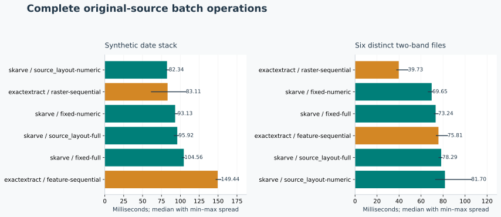
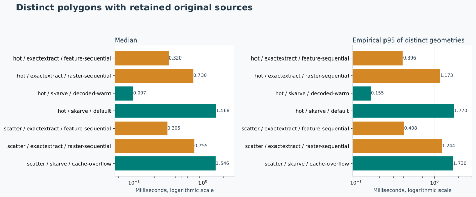
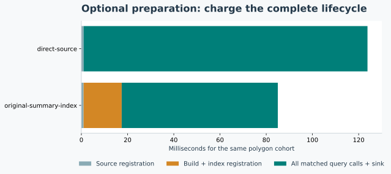
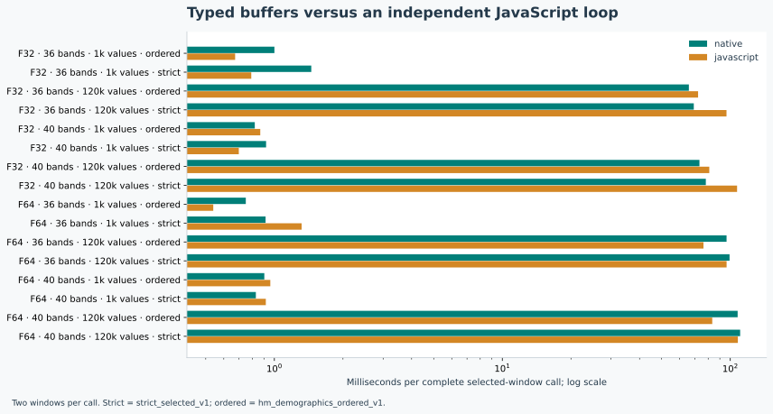

# Skarve — public synthetic release confirmation

Native library `17e3546f7c526d5687b99641ce3f3adaa6d8d85cd7e4786fc84b2e0d2bf78c93`. Seed `193542725648087`. This report describes generated inputs on one host; it does not relabel historical private measurements.

Native checks: **168,456**, native mismatches: **0**. Runtime errors: **0**. External scalar differences exceeding native tolerance: **11,786**; they remain compatibility differences, not an interchangeable-backend guarantee.

Original fixture storage: **2,253,352 bytes**; generation: **368.86 ms**. Peak benchmark process RSS: **236,998,656 bytes**. Optional index storage: **71,656 bytes**; normalized full-raster duplicate: **0 bytes**.

Hardware: AMD Ryzen 7 8745HS w/ Radeon 780M Graphics; Linux x86_64. Versions: `{"exactextract": "0.3.0", "geos": "3.13.1", "native_gdal": "3.8.4", "numpy": "2.5.3", "python": "3.12.3", "rasterio": "1.5.1", "rasterio_gdal": "3.12.4", "shapely": "2.1.2", "skarve-engine": "0.1.0b1"}`.

Batch: public source registration/open, native/shared all-zone execution, result normalization, close and canonical sink. exactextract uses natural all-source all-feature calls. Native adds integer valid count to the five shared fields. Source adapters, fixture creation and independent oracle are reported separately. Single calls retain source handles; warmup/source setup is separate. GDAL cache is 64 MiB; native decoded cache adds explicit 0/1 MiB within the common 2 GiB process cap.

## What this run supports

dates: the lowest observed native median was 82.343 ms (source_layout-numeric); the strongest observed exactextract median was 83.112 ms (raster-sequential), a native/reference ratio of 0.991. Strategies are chosen per family after measurement, and all alternatives remain plotted. Three rounds do not establish a reliable winner where spread overlaps.

files: the lowest observed native median was 69.648 ms (fixed-numeric); the strongest observed exactextract median was 39.732 ms (raster-sequential), a native/reference ratio of 1.753. Strategies are chosen per family after measurement, and all alternatives remain plotted. Three rounds do not establish a reliable winner where spread overlaps.

Single default: 1.568 ms median versus the fastest reference median 0.320 ms on the same hot geometry sequence, native/reference ratio 4.91. Setup and warmup are listed separately; these are retained-source calls on local files.

Single decoded-warm: 0.097 ms median versus the fastest reference median 0.320 ms on the same hot geometry sequence, native/reference ratio 0.30. Setup and warmup are listed separately; these are retained-source calls on local files.

Single cache-overflow: 1.546 ms median versus the fastest reference median 0.305 ms on the same scatter geometry sequence, native/reference ratio 5.07. Setup and warmup are listed separately; these are retained-source calls on local files.

Typed buffers: native medians were lower in 8/16 shapes; native/JavaScript median ratios span 0.69–1.83. Large float64 ordered calls and several small calls lose; the public buffer interface is not a universal speedup. Native results and all exclusion counters match the independent control exactly. RSS is observed for Node, not constrained with a virtual-address limit.

Native and reference GDAL versions differ as recorded above; both use their installed, applicable source adapters. The comparison is between complete systems, not a pure kernel isolation. The 24-band date source is registered in bounded groups of 20 and 4 bands. Thin, holed, multipart, aligned, partial and outside geometries are retained. The single-query source uses one-row strips, so the single result is layout-specific.

## Numerical compatibility

| System | Field | Maximum absolute error | Scalar differences beyond native tolerance |
|---|---|---:|---:|
| skarve | sum | 1.364242053e-11 | 0 |
| skarve | support | 5.00222086e-12 | 0 |
| skarve | mean | 1.280753281e-12 | 0 |
| skarve | min | 0 | 0 |
| skarve | max | 0 | 0 |
| exactextract | sum | 7.077261216e-06 | 5360 |
| exactextract | support | 2.24135556e-06 | 6190 |
| exactextract | mean | 1.336554245e-07 | 236 |
| exactextract | min | 0 | 0 |
| exactextract | max | 0 | 0 |

Checks include repeated rounds; they are not counts of unique polygons. The sum tolerance is 1e-8 + 1e-10 times absolute contribution mass; other floating fields use 1e-8 + 1e-10 times the reference magnitude. Integer counts require equality. Empty exactextract mean/min/max NaN values map to null only at zero support. No nonempty values or precision differences are repaired.

## Cache and setup accounting

```json
[
  {
    "method": "default",
    "queries": 100,
    "cache_budget_bytes": 0,
    "source_registration_ms": 1.064846001099795,
    "warmup_ms": 0,
    "raster_io_calls": 200,
    "decoded_value_bytes": 52428800,
    "cache_hits": 0,
    "cache_misses": 100,
    "cache_evictions": 0,
    "peak_cache_resident_bytes": 0
  },
  {
    "method": "decoded-warm",
    "queries": 100,
    "cache_budget_bytes": 1048576,
    "source_registration_ms": 0.9099349990719929,
    "warmup_ms": 1.5213280021271203,
    "raster_io_calls": 0,
    "decoded_value_bytes": 0,
    "cache_hits": 100,
    "cache_misses": 0,
    "cache_evictions": 0,
    "peak_cache_resident_bytes": 590518
  },
  {
    "method": "cache-overflow",
    "queries": 100,
    "cache_budget_bytes": 1048576,
    "source_registration_ms": 1.3630169996758923,
    "warmup_ms": 0,
    "raster_io_calls": 200,
    "decoded_value_bytes": 52428800,
    "cache_hits": 0,
    "cache_misses": 100,
    "cache_evictions": 99,
    "peak_cache_resident_bytes": 590518
  }
]
```









## Interpretation

- One Linux host; no cold-storage or universal superiority claim.

- Three batch repeats show spread, not a stable p95. Single patterns use distinct geometry.

- GEOS cell intersections and fsum are an independent finite-precision oracle, not exact-real arithmetic. Thin rectangles use separable axis overlap.

- No external reference is automatically eligible for strict execution.

- No private application/source fixture or credential is required.

All plotted numbers are preserved in `summary.json`; complete answers, numerical discrepancies and runtime errors are in `../results/v0.1.0-beta.1/results.json.gz`, with `../results/v0.1.0-beta.1/timings.csv`, `../results/v0.1.0-beta.1/fixtures.json` and `../results/v0.1.0-beta.1/freeze.json`. Lower is better. Every losing method remains visible. The native and reference lanes compute different finite-precision coverage; inspect fieldwise errors before treating a speed comparison as compatible execution.

## Failed or incompatible cases

0 runtime errors; 0 native scalar mismatches; 11,786 external scalar differences across 408 incompatible timing records. The complete per-record discrepancy list is retained in [differences.json](differences.json), and each individual field discrepancy is retained in the raw compressed result receipt.
